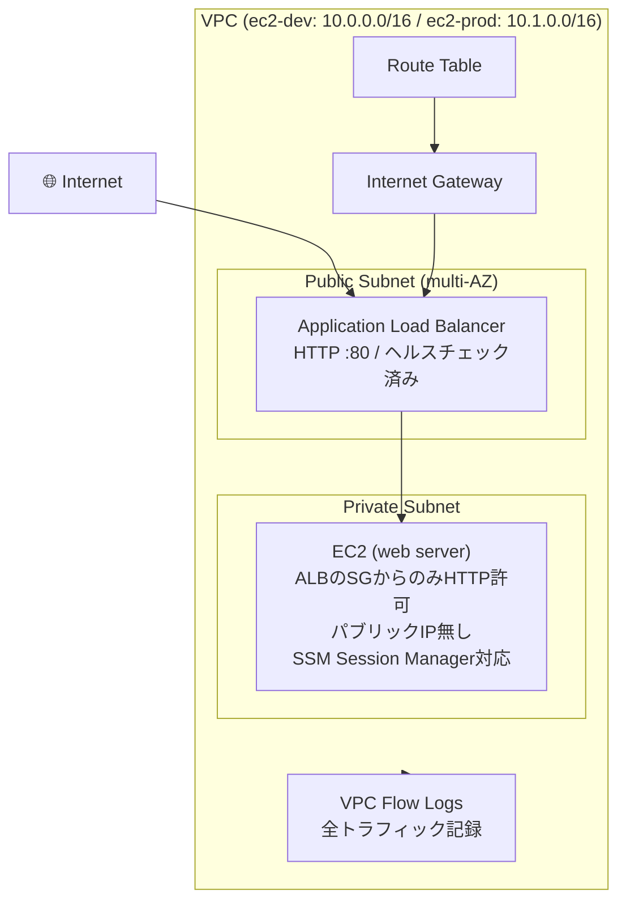
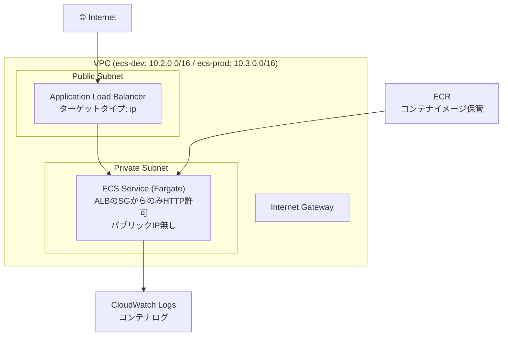
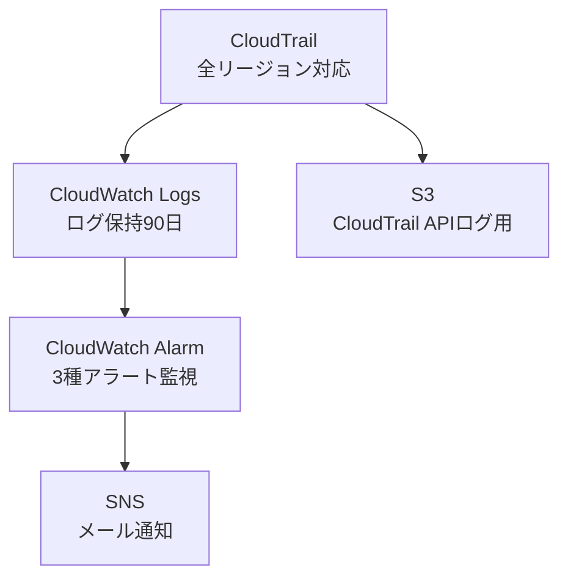

# terraform-study

AWSインフラをTerraformで構築・管理するための学習リポジトリです。
EC2構成とECS(Fargate)構成の両方を実装し、モジュール化・セキュリティ監視・環境分離を意識した実践的な構成を目指しました。

---

## 構成パターン

このリポジトリでは2つのアーキテクチャパターンを比較できる構成にしています。

| パターン | ディレクトリ | 特徴 |
|---|---|---|
| EC2構成 | ec2-dev / ec2-prod | EC2 + ALB。SSM Session Managerでアクセス |
| ECS構成 | ecs-dev / ecs-prod | ECS(Fargate) + ALB。サーバーレスなコンテナ実行 |

---

## AWS構成図（EC2パターン）



## AWS構成図（ECSパターン）



## セキュリティ監視（alert環境）



---

## CI/CDパイプライン

PRを作成するとGitHub Actionsが自動で以下を実行します。

```
fmt → tfsec → validate → tflint → plan (ec2-dev / ec2-prod / matrix戦略)
```

- OIDC認証によりアクセスキー不要でAWSに接続
- matrix戦略で複数環境のplanを並列実行
- planの結果はPRに自動コメント

---

## 構成ファイル

```
terraform-study/
├── .github/workflows/       # GitHub Actions CI/CD
├── bootstrap/                # リモートステート用S3+DynamoDB作成（初回のみ）
├── modules/                  # 再利用可能なモジュール
│   ├── vpc/                  # VPC・サブネット・ルートテーブル・Flow Logs
│   ├── ec2/                  # EC2・セキュリティグループ・SSM用IAMロール
│   ├── alb/                  # ALB（EC2用、ターゲットタイプ: instance）
│   ├── alb-ecs/               # ALB（ECS用、ターゲットタイプ: ip）
│   ├── ecs/                   # ECSクラスタ・タスク定義・サービス（Fargate）
│   ├── ecr/                   # コンテナイメージリポジトリ
│   ├── s3/                    # S3バケット
│   └── security-monitoring/   # CloudTrail・CloudWatch・SNS
├── ec2-dev/                  # EC2構成・開発環境
├── ec2-prod/                 # EC2構成・本番環境
├── ecs-dev/                  # ECS構成・開発環境
├── ecs-prod/                 # ECS構成・本番環境
└── alert/                     # セキュリティ監視環境
```

---

## 作成したAWSリソース

| リソース | 特徴 |
|---|---|
| VPC | パブリック/プライベートサブネット・マルチAZ対応 |
| VPC Flow Logs | 全トラフィック記録・CloudWatch Logs 30日保持 |
| EC2 | ALBからのアクセスのみ許可・パブリックIP無し・SSM対応 |
| ECS (Fargate) | サーバーレスなコンテナ実行環境 |
| ECR | コンテナイメージ保管・ライフサイクルポリシーで自動削除 |
| ALB (EC2用) | ターゲットタイプ instance |
| ALB (ECS用) | ターゲットタイプ ip |
| S3 | CloudTrail APIログ用・1日で自動削除 |
| CloudTrail | 全リージョン対応・CloudWatch Logsへのストリーミング |
| CloudWatch Logs | ログ保持90日 |
| CloudWatch Alarm | 3種のセキュリティアラート |
| SNS | セキュリティアラートのメール通知 |
| IAM | 最小権限のロール・ポリシー設定 |

---

## セキュリティ面での工夫

- EC2へのパブリックIP割り当てなし → ALB経由のアクセスのみに限定
- ECSタスクへのパブリックIP割り当てなし → ALB経由のアクセスのみに限定
- セキュリティグループ → ALBのSGからのHTTPのみ許可
- SSM Session Manager → SSHポート不要・セキュリティグループに穴を開けない
- CloudTrailによる操作ログ記録 → 全リージョン・全サービス対象
- ログ改ざん検知 → enable_log_file_validation = true
- VPC Flow Logs → ネットワークトラフィックを全て記録
- セキュリティアラート → root操作・IAM変更・ログイン失敗を検知してメール通知
- tfstateをGit管理外 → .gitignoreで除外
- 機密情報をコードに直書きしない → terraform.tfvarsをGit管理外・.exampleファイルで管理
- CI用の設定値はci.tfvarsとして管理 → 機密情報を含まない値のみGit管理
- GitHub ActionsのOIDC認証 → アクセスキーをSecretsに保存せずAWSに接続
- AWS SSO（IAM Identity Center） → アクセスキーをローカルに置かない設定
- tfsecによるセキュリティスキャン → PRごとに自動実行
- Branch protection rules → masterへの直接pushを禁止・CI必須
- ECS Exec → Fargate環境でのデバッグ用接続（SSM経由、SSHポート不要）

---

## 環境構成

| 環境 | リージョン | VPC CIDR | アーキテクチャ |
|---|---|---|---|
| ec2-dev | ap-northeast-1 | 10.0.0.0/16 | EC2 + ALB |
| ec2-prod | ap-northeast-1 | 10.1.0.0/16 | EC2 + ALB |
| ecs-dev | ap-northeast-1 | 10.2.0.0/16 | ECS(Fargate) + ALB |
| ecs-prod | ap-northeast-1 | 10.3.0.0/16 | ECS(Fargate) + ALB |
| alert | ap-northeast-1 | - | セキュリティ監視 |

---

## 使用技術

- Terraform ~> 1.15
- AWS Provider ~> 5.0
- AWS ap-northeast-1（東京リージョン）
- GitHub Actions
- Docker / Amazon ECR / Amazon ECS (Fargate)

---

## 使い方

### 前提条件

- Terraform インストール済み
- AWS CLIインストール・プロファイル設定済み（SSO認証）

### 初回セットアップ（リモートステート）

```bash
cd bootstrap
terraform init
terraform apply
# 出力されたバケット名を各環境のbackend.tfvarsに記載
```

### 通常の使い方

```bash
# 例: ec2-dev環境
cd ec2-dev

# tfvarsのサンプルをコピーして編集
cp terraform.tfvars.example terraform.tfvars

# 初期化
terraform init

# 実行計画の確認
terraform plan

# 適用
terraform apply
```

### ECS環境でコンテナイメージを使う場合

```bash
# ECRにログイン
aws ecr get-login-password --region ap-northeast-1 | docker login --username AWS --password-stdin <ECRリポジトリURL>

# イメージをビルド・タグ付け・push
docker build -t terraform-study-ecs-dev .
docker tag terraform-study-ecs-dev:latest <ECRリポジトリURL>:latest
docker push <ECRリポジトリURL>:latest

# ecs-dev/main.tf の container_image を ECRのURLに変更してapply
```

---

## 学んだこと・工夫したこと

- モジュール化による再利用性の向上
- dev/prod環境の分離とCIDR設計
- セキュリティグループの最小権限設定
- CloudTrailとCloudWatchを組み合わせたセキュリティ監視の構築
- AWS SSOによるアクセスキーレスな認証設定
- tfstateや機密情報のGit管理外への除外
- VPC Flow Logsによるネットワーク監視
- ハードコード禁止・tfvarsによる変数管理
- GitHub ActionsとOIDC認証を使ったCI/CDパイプラインの構築
- tfsecによる自動セキュリティスキャン
- ブランチ運用とPRベースの開発フロー
- Branch protection rulesによるmasterブランチの保護
- SSM Session Managerによるポートレスなサーバーアクセス
- Dockerによるコンテナイメージの作成
- ECR/ECS(Fargate)によるサーバーレスコンテナ実行環境の構築
- EC2構成とECS構成、2つのアーキテクチャパターンの実装と比較
- GitHub Actionsのmatrix戦略による複数環境CIの効率化
- ECS Execによるサーバーレス環境でのデバッグ手法

---

## 関連リポジトリ

- [docker-study](https://github.com/108-infra/docker-study) - Docker基礎学習
- [ansible-study](https://github.com/108-infra/ansible-study) - Ansibleによる構成管理

---

## 今後の改善案

- HTTPS対応 → ACM証明書取得・ALBに443リスナーの追加・HTTPリダイレクト
- RDS追加 → プライベートサブネットにDBレイヤーを追加した3層構成
- default_tags → providerブロックで全リソースに共通タグを自動付与
- GitHub ActionsでDockerイメージのビルド・ECRへのpushを自動化
- ECSのCI/CDパイプライン構築（イメージpush → ECSサービス自動更新）
