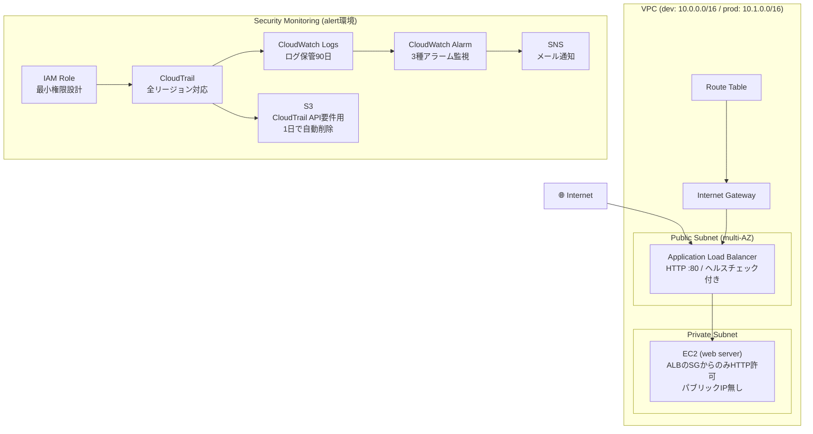

# terraform-study

AWSインフラをTerraformで構築・管理するための学習リポジトリです。  
マルチ環境構成・セキュリティ監視・モジュール化を意識した実践的な構成を目指しました。

---

## AWS構成図



---

## 構成ファイル

```
terraform-study/
├── modules/                  # 再利用可能なモジュール
│   ├── vpc/                  # VPC・サブネット・ルートテーブル
│   ├── ec2/                  # EC2・セキュリティグループ
│   ├── alb/                  # Application Load Balancer
│   ├── s3/                   # S3バケット
│   └── security-monitoring/  # CloudTrail・CloudWatch・SNS
├── dev/                      # 開発環境
├── prod/                     # 本番環境
└── alert/                    # セキュリティ監視環境
```

---

## 構築したAWSリソース

| リソース | 概要 |
|---|---|
| VPC | パブリック/プライベートサブネット構成・マルチAZ対応 |
| EC2 | Webサーバー（ALBからのアクセスのみ許可） |
| ALB | Application Load Balancer・ヘルスチェック設定済み |
| S3 | CloudTrail API要件用（1日で自動削除） |
| CloudTrail | 全リージョン対応・CloudWatch Logsへのストリーミング |
| CloudWatch Logs | ログ保管90日 |
| CloudWatch Alarm | 3種のセキュリティアラーム |
| SNS | セキュリティアラートのメール通知 |
| IAM | 最小権限のロール・ポリシー設計 |

---

## セキュリティ面での工夫

- **EC2へのパブリックIP付与なし** → ALB経由のアクセスのみに限定
- **セキュリティグループ** → EC2はALBのSGからのHTTPのみ許可
- **CloudTrailによる操作ログ記録** → 全リージョン・全サービス対象
- **ログ改ざん検知** → `enable_log_file_validation = true`
- **セキュリティアラート** → 以下を検知してメール通知
  - rootユーザーのコンソールログイン
  - IAMユーザー・ポリシーの変更
  - コンソールログイン失敗（閾値超過）
- **tfstateをGit管理外** → `.gitignore`で除外
- **機密情報をコードに直書きしない** → `terraform.tfvars`をGit管理外・`.example`ファイルで管理
- **AWS SSO（IAM Identity Center）** → アクセスキーをローカルに置かない設計

---

## 環境構成

| 環境 | リージョン | VPC CIDR | 用途 |
|---|---|---|---|
| dev | ap-northeast-1 | 10.0.0.0/16 | 開発環境 |
| prod | ap-northeast-1 | 10.1.0.0/16 | 本番環境 |
| alert | ap-northeast-1 | - | セキュリティ監視 |

---

## 使用技術

- **Terraform** ~> 1.15
- **AWS Provider** ~> 5.0
- **AWS** ap-northeast-1（東京リージョン）

---

## 使い方

### 前提条件

- Terraform インストール済み
- AWS CLIインストール・プロファイル設定済み（SSO推奨）

### 実行手順

```bash
# 例: dev環境
cd dev

# tfvarsのサンプルをコピーして編集
cp terraform.tfvars.example terraform.tfvars

# 初期化
terraform init

# 実行計画の確認
terraform plan

# 適用
terraform apply
```

---

## 学んだこと・意識したこと

- モジュール化による再利用性の向上
- dev/prod環境の分離とCIDR設計
- セキュリティグループの最小権限設計
- CloudTrailとCloudWatchを組み合わせたセキュリティ監視の構築
- AWS SSOによるアクセスキーレスな認証設計
- tfstateや機密情報のGit管理外への除外

## 今後の改善案

- **リモートステート管理** → S3 + DynamoDBでtfstateを管理しチーム開発に対応
- **HTTPS対応** → ACM証明書取得・ALBに443リスナー追加・HTTPリダイレクト
- **RDS追加** → プライベートサブネットにDBレイヤーを追加した3層構成
- **CI/CD** → GitHub ActionsでPR時にterraform planを自動実行