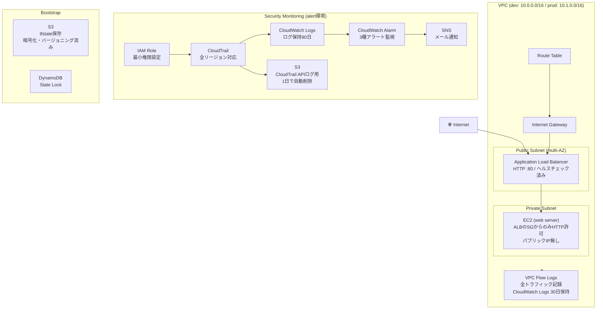

# terraform-study

AWSインフラをTerraformで構築・管理するための学習リポジトリです。
モジュール化・セキュリティ監視・環境分離を意識した実践的な構成を目指しました。

---

## AWS構成図



---

## CI/CDパイプライン

PRを作成するとGitHub Actionsが自動で以下を実行します。

```
fmt → tfsec → validate → tflint → plan (dev/prod)
```

- OIDC認証によりアクセスキー不要でAWSに接続
- planの結果はPRに自動コメント

---

## 構成ファイル

```
terraform-study/
├── .github/workflows/       # GitHub Actions CI/CD
├── bootstrap/               # リモートステート用S3+DynamoDB作成（初回のみ）
├── modules/                 # 再利用可能なモジュール
│   ├── vpc/                 # VPC・サブネット・ルートテーブル・Flow Logs
│   ├── ec2/                 # EC2・セキュリティグループ
│   ├── alb/                 # Application Load Balancer
│   ├── s3/                  # S3バケット
│   └── security-monitoring/ # CloudTrail・CloudWatch・SNS
├── dev/                     # 開発環境
├── prod/                    # 本番環境
└── alert/                   # セキュリティ監視環境
```

---

## 作成したAWSリソース

| リソース | 特徴 |
|---|---|
| VPC | パブリック/プライベートサブネット・マルチAZ対応 |
| VPC Flow Logs | 全トラフィック記録・CloudWatch Logs 30日保持 |
| EC2 | ALBからのアクセスのみ許可・パブリックIP無し |
| ALB | Application Load Balancer・ヘルスチェック設定済み |
| S3 | CloudTrail APIログ用・1日で自動削除 |
| CloudTrail | 全リージョン対応・CloudWatch Logsへのストリーミング |
| CloudWatch Logs | ログ保持90日 |
| CloudWatch Alarm | 3種のセキュリティアラート |
| SNS | セキュリティアラートのメール通知 |
| IAM | 最小権限のロール・ポリシー設定 |

---

## セキュリティ面での工夫

- EC2へのパブリックIP割り当てなし → ALB経由のアクセスのみに限定
- セキュリティグループ → EC2はALBのSGからのHTTPのみ許可
- CloudTrailによる操作ログ記録 → 全リージョン・全サービス対象
- ログ改ざん検知 → enable_log_file_validation = true
- VPC Flow Logs → ネットワークトラフィックを全て記録
- セキュリティアラート → 以下を検知してメール通知
  - rootユーザーのコンソールログイン
  - IAMユーザー・ポリシーの変更
  - コンソールログイン失敗（閾値超え）
- tfstateをGit管理外 → .gitignoreで除外
- 機密情報をコードに直書きしない → terraform.tfvarsをGit管理外・.exampleファイルで管理
- CI用の設定値はci.tfvarsとして管理 → 機密情報を含まない値のみGit管理
- GitHub ActionsのOIDC認証 → アクセスキーをSecretsに保存せずAWSに接続
- AWS SSO（IAM Identity Center） → アクセスキーをローカルに置かない設定
- tfsecによるセキュリティスキャン → PRごとに自動実行
- Branch protection rules → masterへの直接pushを禁止・CI必須

---

## 環境構成

| 環境 | リージョン | VPC CIDR | 用途 |
|---|---|---|---|
| dev | ap-northeast-1 | 10.0.0.0/16 | 開発環境 |
| prod | ap-northeast-1 | 10.1.0.0/16 | 本番環境 |
| alert | ap-northeast-1 | - | セキュリティ監視 |

---

## 使用技術

- Terraform ~> 1.15
- AWS Provider ~> 5.0
- AWS ap-northeast-1（東京リージョン）
- GitHub Actions

---

## 使い方

### 前提条件

- Terraform インストール済み
- AWS CLIインストール・プロファイル設定済み（SSO認証）

### 初回セットアップ（リモートステート）

```bash
cd bootstrap
terraform init
terraform apply
# 出力されたバケット名を dev/backend.tfvars と prod/backend.tfvars に記載
```

### 通常の使い方

```bash
# 例: dev環境
cd dev

# tfvarsのサンプルをコピーして編集
cp terraform.tfvars.example terraform.tfvars

# 初期化
terraform init

# 実行計画の確認
terraform plan

# 適用
terraform apply
```

---

## 学んだこと・工夫したこと

- モジュール化による再利用性の向上
- dev/prod環境の分離とCIDR設計
- セキュリティグループの最小権限設定
- CloudTrailとCloudWatchを組み合わせたセキュリティ監視の構築
- AWS SSOによるアクセスキーレスな認証設定
- tfstateや機密情報のGit管理外への除外
- VPC Flow Logsによるネットワーク監視
- ハードコード禁止・tfvarsによる変数管理
- GitHub ActionsとOIDC認証を使ったCI/CDパイプラインの構築
- tfsecによる自動セキュリティスキャン
- ブランチ運用とPRベースの開発フロー
- Branch protection rulesによるmasterブランチの保護

---

## 今後の改善案

- HTTPS対応 → ACM証明書取得・ALBに443リスナーの追加・HTTPリダイレクト
- RDS追加 → プライベートサブネットにDBレイヤーを追加した3層構成
- default_tags → providerブロックで全リソースに共通タグを自動付与
